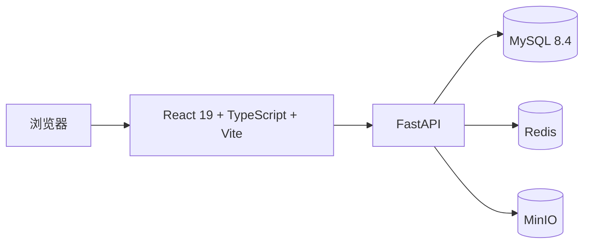

# 辰光 Agent

> 面向企业内部的 AI Agent 管理与治理平台。统一管理模型、Prompt、Agent、知识库、工具、会话与系统权限，并提供可审计的后台管理界面。

辰光 Agent 采用前后端分离架构：React 管理端默认连接 FastAPI 服务，核心管理域已经具备数据库持久化、接口权限校验和前端操作闭环。

## 目录

- [功能概览](#功能概览)
- [技术架构](#技术架构)
- [快速开始](#快速开始)
- [常用命令](#常用命令)
- [接口与文档](#接口与文档)
- [当前边界](#当前边界)
- [项目结构](#项目结构)
- [贡献与许可](#贡献与许可)

## 功能概览

- **身份与权限**：图形验证码、用户名密码登录、JWT 鉴权，以及后端与前端一致执行的 RBAC 权限控制。
- **模型与 Agent 配置**：模型供应商、模型元数据、Prompt、Agent 的创建、编辑、发布、版本和回滚管理。
- **知识库管理**：文档上传至 MinIO，异步解析文本、PDF、DOCX，支持分段管理、重试和词项全文检索。
- **工具管理**：管理工具配置、启停状态与 HTTP 工具连通性测试；敏感配置会加密存储并在展示时脱敏。
- **运营与治理**：会话与链路记录、用量和成本分析、API Key、审计日志、告警规则、系统设置及工作台汇总。

## 技术架构



| 层级 | 技术 |
| --- | --- |
| 前端 | React 19、TypeScript、Vite、Tailwind CSS、shadcn/ui |
| 后端 | Python、FastAPI、SQLAlchemy Async、Alembic、Pydantic |
| 基础设施 | MySQL 8.4、Redis、MinIO |
| 认证与授权 | JWT、RBAC、验证码 |

## 快速开始

### 前置条件

- Python 3.11+
- Node.js 20.19+ 和 npm
- Docker Desktop（推荐，用于启动 MySQL、Redis 和 MinIO）

### 1. 启动依赖服务

仓库提供了仅包含基础设施的 Docker Compose 配置；后端和前端仍在宿主机上运行。

```powershell
docker compose -f docker/docker-compose.yaml up -d
```

启动后可访问 MinIO 控制台：<http://127.0.0.1:9001>，本地默认账号为 `minioadmin`，密码为 `minioadmin123`。

> Compose 文件中的账号密码仅用于本地开发。部署到共享或生产环境前，务必替换全部默认密码。

### 2. 配置并启动后端

在项目根目录创建虚拟环境、安装依赖并复制配置模板：

```powershell
python -m venv .venv
.\.venv\Scripts\Activate.ps1
python -m pip install --upgrade pip
pip install -r requirements.txt
Copy-Item .env.example .env
```

如果使用上一步启动的 Docker 服务，请编辑 `.env`，使相关配置与 `docker/docker-compose.yaml` 保持一致：

```dotenv
APP_NAME=辰光 Agent
APP_SECRET_KEY=replace-with-a-long-random-secret

DB_HOST=127.0.0.1
DB_PORT=3306
DB_USER=root
DB_PASSWORD=123456
DB_NAME=chenguang

REDIS_HOST=127.0.0.1
REDIS_PORT=6379
REDIS_PASSWORD=123456

MINIO_ENDPOINT=127.0.0.1:9000
MINIO_ACCESS_KEY=minioadmin
MINIO_SECRET_KEY=minioadmin123
MINIO_BUCKET=knowledge-docs
MINIO_SECURE=false
```

执行迁移、创建首个超级管理员并启动 API：

```powershell
alembic upgrade head
python -m src.scripts.create_superuser --username admin --email admin@example.com
uvicorn src.main:app --reload --host 127.0.0.1 --port 8000
```

创建超级管理员时，命令会交互式读取并确认密码，不会将密码写入命令历史。

### 3. 启动前端

另开一个终端：

```powershell
cd app
npm ci
npm run dev
```

打开 Vite 输出的地址，默认是 <http://127.0.0.1:5173>。前端默认请求 `http://127.0.0.1:8000/api/v1`；若后端不在默认地址，启动前设置 `VITE_API_BASE`：

```powershell
$env:VITE_API_BASE = 'http://127.0.0.1:8000/api/v1'
npm run dev
```

纯前端原型开发才需要显式开启 Mock 数据：

```powershell
$env:VITE_USE_MOCK = 'true'
npm run dev
```

## 常用命令

| 目的 | 命令 |
| --- | --- |
| 运行后端测试 | `python -m pytest` |
| 执行数据库迁移 | `alembic upgrade head` |
| 导出 OpenAPI 契约 | `python -m src.scripts.export_openapi` |
| 启动后端开发服务 | `uvicorn src.main:app --reload --port 8000` |
| 检查前端代码 | `cd app && npm run lint` |
| 构建前端生产包 | `cd app && npm run build` |
| 校验前端 OpenAPI 覆盖率 | `cd app && npm run check:openapi` |
| 停止本地基础设施 | `docker compose -f docker/docker-compose.yaml down` |

## 接口与文档

后端启动后可通过以下入口查看和验证服务：

| 入口 | 地址 |
| --- | --- |
| 健康检查 | <http://127.0.0.1:8000/health> |
| Swagger UI | <http://127.0.0.1:8000/docs> |
| OpenAPI JSON | <http://127.0.0.1:8000/openapi.json> |
| 静态接口契约 | [docs/openapi.json](docs/openapi.json) |
| 前端说明 | [app/README.md](app/README.md) |
| 项目工作手册 | [docs/PROJECT_GUIDE_FOR_SOL.md](docs/PROJECT_GUIDE_FOR_SOL.md) |

API 统一使用 `/api/v1` 前缀。除健康检查、验证码和登录外，接口均需要 Bearer Token 与对应权限；完整的路径、参数和数据模型以 Swagger UI 或 OpenAPI 契约为准。

## 当前边界

本项目当前重点是 Agent 的**配置、管理和治理**，以下能力尚未实现，不应视为现有功能：

- 调用模型供应商执行推理、流式对话或 Agent 编排；
- Embedding 生成、向量数据库和向量/混合检索；
- 内置工具或自定义函数的执行沙箱；
- 以 API Key 作为接口认证方式；
- 告警规则的自动评估与外部通知发送。

知识库目前采用词项全文检索；文档解析在 FastAPI 进程内以后台任务执行，服务重启不会自动恢复未完成任务。生产环境应使用独立的任务队列和持久化调度方案。

## 项目结构

```text
.
├── app/                 # React 管理端
├── src/                 # FastAPI 应用
│   ├── core/            # 配置、安全、权限、异常与响应
│   ├── infra/           # MySQL、Redis、MinIO 适配器
│   ├── middlewares/     # 请求日志与审计日志
│   ├── modules/         # 按业务域划分的 API、服务与模型
│   └── scripts/         # 超级管理员与 OpenAPI 工具
├── alembic/             # 数据库迁移
├── docker/              # 本地基础设施 Compose 配置
├── docs/                # OpenAPI 契约和项目手册
├── test/                # 后端自动化测试
├── .env.example         # 环境变量模板
└── requirements.txt     # Python 依赖
```

## 贡献与许可

提交前请至少运行与改动相关的测试或检查，并确保敏感信息不会进入版本控制。环境变量文件、运行日志和本地 Docker 数据目录已被 `.gitignore` 忽略。

本项目采用 [MIT License](LICENSE) 开源。
